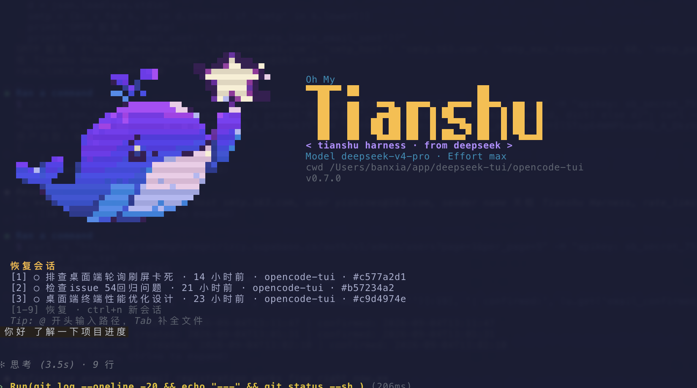

# Oh My Tianshu

English | [中文](README.zh.md)

<p align="center">
  
</p>

<p align="center">
  <a href="https://www.npmjs.com/package/@huiliyi37/oh-my-tianshu"></a>
  <a href="https://github.com/huiliyi37/oh-my-tianshu/releases"></a>
  <a href="https://github.com/huiliyi37/oh-my-tianshu/actions/workflows/ci.yml"></a>
  
  
  <a href="https://github.com/huiliyi37/oh-my-tianshu/stargazers"></a>
</p>

Oh My Tianshu (`oh-my-tianshu`) is a full-capability open-source coding agent built on a plugin harness: models, tools, policies, memory, retrieval, and interfaces are all Cordis plugins a deployment can compose, replace, or extend without touching the agent loop.

One distribution, four surfaces — full-screen terminal UI, browser UI, headless one-shot runs, and an ACP automation server — over a deep capability bench: a vision bridge plus an `ask_image` co-pilot so text-only primaries still work with images, cross-session project memory with a write-quality gate, an evidence gate enforcing RED→GREEN on bugfix edits, an agent router that moves from shadow to gradual dispatch over native subagents, semantic (BM25, CJK-aware, optional vector) and tree-sitter graph code retrieval, plan mode with per-session presets, pre-write file snapshots behind `/rewind`, and prefix-cache health observation that keeps long sessions cheap.

Sessions are authoritative and reconstructable: anything the model sees is logged to the session stream, and persistence, resume/fork/query, replay, telemetry, and every UI derive from the same events. Composition stays cache-friendly by design — presets own the agent plane, so the cached prefix stays byte-stable while a session's toolset and persona change.

It is a friendly fork of [DeepSeek Harness](https://github.com/deepseek-ai) (`dsh`, MIT) released under the **Apache License 2.0**; this line evolves independently from the 2026-08 baseline and does not track upstream. Full attribution lives in [NOTICE](NOTICE).

The repository is a pnpm monorepo: 250+ Cordis plugin packages (including vendored upstreams), indexed by group — `core / tui / host / client / guard / subagent / context / memory` and friends — in [packages/README.md](packages/README.md), all published to npm under the `@huiliyi37/*` scope. See the [architecture doc](docs/architecture.md) for the design overview and [docs/user](docs/user/index.md) for usage docs.

## Install

Requirements: Node `^22.19 || >=24`, and a DeepSeek API key (`DEEPSEEK_API_KEY`).

One-line installer (recommended — it auto-recovers the npm-mirror sync window, where a mirror already has the new entry package but not all of its dependencies and a plain install dies with `ETARGET`):

```sh
curl -fsSL https://raw.githubusercontent.com/huiliyi37/oh-my-tianshu/main/scripts/install.sh | sh
```

Windows PowerShell:

```powershell
irm https://raw.githubusercontent.com/huiliyi37/oh-my-tianshu/main/scripts/install.ps1 | iex
```

Run it straight from npm:

```sh
npx @huiliyi37/oh-my-tianshu tui
```

Or install globally:

```sh
npm i -g @huiliyi37/oh-my-tianshu
oh-my-tianshu tui
```

npm 11 and newer blocks lifecycle scripts it has not been told to allow (`allowScripts`). The native dependencies need theirs — `koffi` compiles from source, `node-pty` builds its PTY binary, `@huiliyi37/dsh-subprocess-local` restores the PTY spawn-helper's executable bit, and `@google/genai` / `protobufjs` generate runtime assets — so allow them on the global install:

```sh
npm i -g --allow-scripts=koffi,node-pty,@huiliyi37/dsh-subprocess-local,@google/genai,protobufjs @huiliyi37/oh-my-tianshu
```

If npm still warns about a package not on this list, append it and re-run; a silently skipped native build surfaces later as `Cannot find module` at runtime.

#### Android (Termux)

On Termux (or a `proot-distro` root) `process.platform` is `android`, the `koffi` FFI dependency has no Android prebuilt and compiles from source, and its CMake configure needs the Termux prefix — which a `proot-distro` root may not export. Set it before installing:

```sh
export PREFIX=/data/data/com.termux/files/usr
npm i -g @huiliyi37/oh-my-tianshu
```

**API key**: export it before starting, or drop it in the user env file once (loaded automatically on every boot):

```sh
export DEEPSEEK_API_KEY=sk-…
echo 'DEEPSEEK_API_KEY=sk-…' >> ~/.dsh-tianshu/.env
```

The first line covers the current shell; the second persists it.

On the welcome screen, check the environment line: `API Key ✓` means the key is in place; `API Key ✗` means it was not found — set it and restart. Quit with `Ctrl+Q` or `/exit`.

For development (or to hack on the harness itself), run from a repository checkout — requires `git`, Node `^22.19 || >=24`, and `pnpm`:

```sh
git clone https://github.com/huiliyi37/oh-my-tianshu.git
cd oh-my-tianshu
pnpm install
pnpm run build
pnpm oh-my-tianshu tui
pnpm oh-my-tianshu web
```

`pnpm oh-my-tianshu tui` runs the full-screen terminal UI from source; `pnpm oh-my-tianshu web` serves the Web UI at `http://127.0.0.1:3080`.

## What the full build adds

Beyond the upstream baseline (files, shell/PTY, skills, tasks/goals/plans, subagents and workflows, sandboxing and approvals, resumable sessions, LSP, web access, context compaction, loop-hygiene guards), this monorepo ships the differentiated capability set:

| Capability | Package | What it does |
|---|---|---|
| Vision bridge | `@huiliyi37/dsh-vision-bridge` | A text-only primary still reads user images: a dedicated vision model describes attachments and injects the description at `agent/pre-step`. |
| Vision co-pilot | `@huiliyi37/dsh-vision-ask` | Session-scoped image registry + `ask_image` tool: the main model re-interrogates any retained image, any number of times, without the user re-sending it. |
| Project memory | `@huiliyi37/dsh-memory` | Cross-session recall (BM25 hybrid over structured claims and knowledge notes) with a quality gate on writes; `/memory`, `/remember`. |
| Evidence gate | `@huiliyi37/dsh-evidence-gate` | RED→GREEN discipline for bugfix tasks: edits gated on a failing-first verification account. |
| Agent router | `@huiliyi37/dsh-agent-router` | Base metrics → routing algorithm → MoE-style dispatch onto native subagents. |
| Pheromone | `@huiliyi37/dsh-pheromone` | File-level stigmergy: session-scoped spatial memory via exponential-decay signals (fragile / entry-point / …). |
| Semantic index | `@huiliyi37/dsh-semantic-index` | Workspace retrieval: file-level BM25 (CJK-bigram aware) over definition-aligned chunks, optional vector layer fused via RRF; powers `semantic_search`. |
| Meridian | `@huiliyi37/dsh-meridian` | Codebase graph index (tree-sitter → sqlite): repo map, impact analysis, flow queries, behavior signals; powers `repo_graph`. |
| File rewind | `@huiliyi37/dsh-fs-snapshot` | Pre-write snapshots of every file a write tool touches, backing `/rewind`'s code/both granularity. |
| Git seam | `@huiliyi37/dsh-git` | Typed git capability service (`GitLocal` CLI provider, typed `GitError`s) consumed by tools and UI. |
| Terminal UI | `@huiliyi37/dsh-tui` | Full-screen TUI on the Tianshu ([Tianshu-harness](https://github.com/huiliyi37/Tianshu-harness)) render core — Apache-2.0 provenance chain preserved. |
| Spark anchors | `@huiliyi37/dsh-spark-anchors` | Pairs with reasoning-truncating provider routes: re-injects excluded paths so the model does not re-derive ruled-out options. |

## Use Tianshu

### Web UI

One command from the npm install; the default `http://127.0.0.1:3080` opens in your browser automatically (`--no-open` suppresses the auto-open):

```sh
oh-my-tianshu web
oh-my-tianshu web --host 0.0.0.0 --port 8080
```

Common flags: `--host` / `--port` bind the address and port, `--dev` mounts the HMR receiver (run `pnpm run dev:web` alongside to rebuild bundles), `--workspace-root` sets the parent directory for workspaces created from the browser, `--trusted-host` extends the `/api` browser-trust fence, `--no-open` skips the auto-open. A source checkout runs `pnpm run build` for the frontend artifacts, then `pnpm oh-my-tianshu web`.

### Profiles

`oh-my-tianshu` boots profiles — ordered stacks of plugin-bundle patch layers under your own overrides in `$DSH_HOME/profiles/<name>`:

```sh
oh-my-tianshu --profile web                       # the browser UI (same as: oh-my-tianshu web)
oh-my-tianshu plugin --profile tui add <package>  # install a plugin into a custom profile
oh-my-tianshu --profile tui                       # boot it
```

The [CLI contract](apps/cli/README.md#profiles) describes profile layout, layer semantics, and config dump commands.

### Terminal UI

Start the full-screen terminal interface:

```sh
oh-my-tianshu tui          # or: oh-my-tianshu --profile tui
```

The TUI is a port of the Tianshu (Tianshu-harness) render core adapted to the harness seams, with an oh-my-pi-aligned interface: a bordered welcome card with a gradient logo, a segmented status bar embedded in the composer's top border, full-width message-surface tints (user bubble, per-status tool blocks), and 17 themes (the amber `omp` is the default, `graphite` and friends remain via `/theme`). Type `/` to open the command menu — ↑↓ to select, Tab to accept, Enter to submit, Esc to close. Press `Ctrl+.` any time for the shortcut map.

**Slash commands**

| Command | Effect |
|---|---|
| `/session` | session management (list / switch) |
| `/fork [directive]` | fork the current session (history copied) and switch; optional first message |
| `/branch` | alias of `/fork` |
| `/model [provider/model]` | view or switch the model (hot-swaps the live session; `spark-flash` / `spark-pro` aliases switch to DeepSeek Spark) |
| `/theme [name]` | switch themes |
| `/welcome [whale\|fox]` | switch the welcome hero mascot (default whale; applies on next startup) |
| `/clear` | clear the current conversation's scrollback |
| `/compact` | compact the current session's context |
| `/steer <text>` | mid-turn steering (redirect without interrupting) |
| `/status` | status panel (goal/todos/plan projections + session totals) |
| `/config` | settings panel (settings / permission / credentials) |
| `/skills` | skill browser panel |
| `/subagents` | delegation-tree panel |
| `/workflow` | running-workflow panel |
| `/next-workflow [candidates] <objective>` | run the fixed intent → plan → critique → implement → verify → review pipeline; VERIFY reports `unverified` unless the profile configures `verifyCommand`; invoke after zen promotion |
| `/tasks` | task panel (background tasks) |
| `/goal` | goal management (create / pause / resume / complete / block) |
| `/memory` | memory browser (list / filter / delete / preview) |
| `/remember <text>` | save a memory |
| `/rewind` | two-phase rollback (message list → granularity) |
| `/btw <question>` | side-question to the background agent |
| `/doctor` | terminal diagnostics with fix guidance |
| `/mcp` | list connected MCP servers and tools |
| `/export [path]` | export the current session's transcript to a Markdown file |
| `/density` | toggle compact tool-card rendering |
| `/permission` | switch the permission preset (workspace-write / danger-full-access) |

**Keyboard shortcuts**

| Key | Effect |
|---|---|
| `Ctrl+N` | new session |
| `Ctrl+S` | resume the most recent session |
| `Ctrl+Q` | quit |
| `Ctrl+P` | command palette |
| `Ctrl+.` | shortcut map overlay |
| `Ctrl+F` | history search (n/N jump) |
| `Ctrl+O` | open the input line in `$EDITOR` |
| `Ctrl+T` | mid-turn steer |
| `Ctrl+V` | paste the system-clipboard image (clipboard-text fallback when the clipboard holds no image) |
| `Alt+W` | copy the selection to the system clipboard (OSC52) |
| `Shift+Tab` | cycle mode: normal → plan → always-approve |
| `Tab` | `@`-path completion; accept a slash-menu selection |
| `↑/↓` | input history (menu selection while the slash menu is open) |
| `PageUp/PageDown` | page the slash menu |
| `Esc` | close the slash menu or overlays |

**Interaction**

Tool approvals prompt inline as `⚠ 允许执行 …？[y/N]` with a unified diff preview above the prompt. Subagent runs appear as spinner lines in the live region and settle into ✓/✗/◌ scrollback entries on completion. The bottom three rows are the input line (with a bottom-edge line colored by mode), the footer (mode badges + shortcut hints), and the metrics row (model / token usage / cache hit rate).

**Image paste and terminal preview**

`Ctrl+V` (or right-click / terminal-menu paste) reads the system clipboard image — macOS `osascript`, Linux `wl-paste`/`xclip`, Windows PowerShell — and attaches it; pasting text that looks like an image path loads the file as an attachment instead. Attached images render as a `📎 N images` marker above the input line and, on submit, as inline terminal graphics (kitty / iTerm2 protocols) under the user bubble. The bubble carries a vision hint: an image-capable primary sees the image directly; a text-only primary with a vision bridge configured gets the image described by the vision model first; with neither, the TUI warns that the image was not sent (and does not submit it).

**Vision bridge (optional)**

`dsh-vision-bridge` lets a text-only primary still read user images: at `agent/pre-step` it describes image attachments through a dedicated vision model and injects the description as a plugin-source user message (model-visible ⟺ logged; bridge failure degrades to a visible note, never a failed turn). Enable by adding the plugin with a vision-capable provider/model:

```yaml
# cordis.yml
- id: vision-bridge
  name: '@huiliyi37/dsh-vision-bridge'
  config:
    provider: deepseek-official   # any registered llm route that can see images
    model: <vision-capable model>
```

and set the TUI's `vision` state (in the `tui-runner` bundle config) so the bubble hint reflects the bridge: `supportsVision: false`, `bridgeEnabled: true`.

**Vision co-pilot (`ask_image`, optional)**

`dsh-vision-ask` goes one step further than the bridge: every image the user attaches is registered in a session-scoped registry under a short id (`img_1`, …), and the `ask_image` tool lets the main model re-interrogate any retained image — different questions, different angles — without the user re-sending it. A multimodal primary gets the original image forwarded back; a text-only primary gets a vision-model answer about the image. See [`packages/tui/vision-ask`](packages/tui/vision-ask/README.md) for configuration.

**DeepSeek Spark mode**

The `deepseek-spark` provider route truncates assistant reasoning to the tail N tokens on the wire (flash 300 / pro opt-in), keeping the model's context lean; `dsh-spark-anchors` pairs with it, re-injecting the excluded paths so the model does not re-derive ruled-out options. Enable once — settings hot-reload, no restart:

```yaml
# settings.yaml
llm-deepseek:
  spark:
    enabled: true
```

then switch with `/model spark-flash` or `/model spark-pro` (aliases for `deepseek-spark/deepseek-v4-flash` / `deepseek-spark/deepseek-v4-pro`). Spark shares the DeepSeek API key — no extra configuration. `dsh-spark-anchors` mounts with the `tui` bundle, so the anchor compensation is live once a session runs on the `deepseek-spark` route; a self-assembled profile adds it explicitly (see the [package README](packages/context/spark-anchors/README.md)).

### Headless

Run one task, print the final answer, and exit:

```sh
oh-my-tianshu run "summarize this workspace"
```

### Automation and SDKs

From a source checkout with `DEEPSEEK_API_KEY` in the environment or its root `.env`, start the ACP automation server:

```sh
pnpm run demo:acp
```

The [Python SDK](python/README.md) drives a bundled JSON-RPC runtime. The [examples](examples/README.md) cover the runnable headless, ACP, JSON-RPC, Code Mode, and self-referential compositions.

## Architecture

- **Everything is a plugin.** Models, tools, policies, storage, context management, and interfaces are composable [Cordis plugins](docs/user/develop/basic/index.md), so deployments can extend or replace behavior without forking the agent loop. See the [architecture](docs/architecture.md) for the underlying design.
- **Runs are reconstructable.** Anything visible to the model is logged in the authoritative session stream; persistence, resume/fork/query, replay, telemetry, and UIs derive from the same events. See the [session-log architecture](docs/architecture.md#session-log).
- **Code Mode (opt-in).** It exposes a `run_code` tool and a generated TypeScript SDK; only program output re-enters model context. See [Code Mode](packages/core/tools/README.md#code-mode).
- **Self-referential Cordis tools are opt-in.** They let the agent inspect its live runtime and mount or unmount plugins while it runs. See the [Cordis tools](packages/self-modification/tool-cordis/README.md).

## Telemetry

Disabled by default — nothing is uploaded anywhere. To stream session telemetry to your **own** OTLP/HTTP collector, set `DSH_TELEMETRY_OTLP_URL` (e.g. `https://collector.example.com/v1/logs`). A non-empty `DSH_TELEMETRY_DISABLED` force-disables it regardless of other settings.

## Relationship with upstream `dsh` and coexistence

This project forked from DeepSeek Harness (MIT) at the 2026-08 baseline and evolves independently — it does not track upstream releases, and its packages live under the `@huiliyi37/*` npm scope (CLI: `@huiliyi37/oh-my-tianshu`, bin `oh-my-tianshu`). The repository is licensed under the Apache License 2.0; upstream attribution is preserved in [NOTICE](NOTICE), and the TUI package carries its own Apache-2.0 provenance chain ([LICENSE](packages/tui/tui/LICENSE) / [NOTICE](packages/tui/tui/NOTICE) / [SOURCE-MAP](packages/tui/tui/SOURCE-MAP.md)).

**Two distribution lines, installable side by side without conflicts:**

| Line | What it is | Data home |
|---|---|---|
| Official `dsh` + [`dsh-tianshu-tui`](https://github.com/huiliyi37/dsh-tianshu-tui) (plugin) | A TUI plugin for the official DeepSeek Harness, installed into an official profile | `~/.dsh` (fixed by the official CLI) |
| This repo (oh-my-tianshu, formerly tianshu-public) | A standalone integrated distribution with its own CLI (`oh-my-tianshu`) | A dedicated `$DSH_HOME` (defaults to `~/.dsh-tianshu`, isolated from the official `~/.dsh`) |

- This repo fully honors `$DSH_HOME` (precedence: explicit config > `$DSH_HOME` > default home). When coexisting with the official dsh, set `export DSH_HOME=~/.dsh-tianshu` (no manual setup needed once the default-home isolation lands). Sessions / profiles / settings stay separate.
- **Naming memo (avoid confusion)**: `dsh-tianshu-tui` = the TUI plugin for official dsh; `oh-my-tianshu` / `@huiliyi37/oh-my-tianshu` = the standalone integrated distribution; `Tianshu-harness` (Tianshu) = the render-core source repository (Apache-2.0).
- **Renaming plan (phase 2)**: the repo will be uniformly named `oh-my-tianshu`, and the launch command plus npm package name will follow (`oh-my-tianshu` → new command name) to eliminate semantic confusion with the plugin name `dsh-tianshu-tui`; this section will be updated then.

## Development

Start with the [development guide](docs/development.md) and read the [architecture](docs/architecture.md) before changing packages.

For agents, follow [AGENTS.md](AGENTS.md).

## License

[Apache-2.0](LICENSE). Upstream and third-party attributions: [NOTICE](NOTICE) and [THIRD_PARTY_NOTICES.md](THIRD_PARTY_NOTICES.md).
