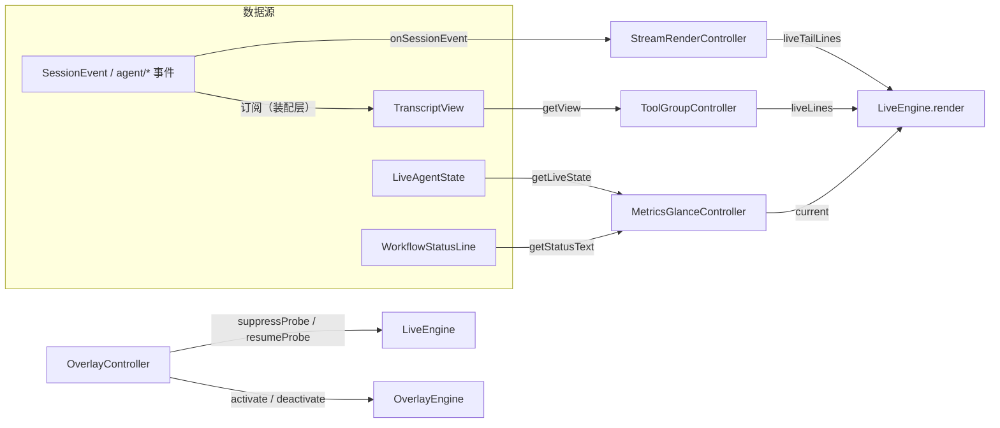

# TUI render controller layer (the renderLive assembly split)

English | [中文](tui-render-controllers.zh.md)

> Status: shipped. The four controllers live in `packages/tui/tui/src/engine/*-controller.ts`; the sole owner of the assembly point is `ui/app.ts` — `renderLive()` only composes and colors, and no longer derives line sources inline.

## Motivation

`TuiApp.renderLive()` inlined every line source of the live region in a single method: status-line derivation, error-line formatting, the streaming tail, in-flight tool cards, slash hints, and the input line. The six responsibilities were entangled with each other, none could be unit-tested in isolation, and any small tweak could ripple through the whole-frame assembly. Controllerization consolidates each line source into an independent controller, each with its own unit tests; `renderLive` reduces to a composition layer of "read controllers → compose lines → color".

Controllers only consume existing data (`session/event`, `agent/*`, `TranscriptView`, `LiveAgentState`) and invent no event types; they only compose existing `engine/` primitives (LiveEngine / OverlayEngine / StreamRenderer / BlockStreamWriter / the format layer) and do not modify them.

## Controller map

## Per-controller contracts

### `engine/stream-render-controller.ts`

Streaming commit / tail control. Composes BlockStreamWriter (throttled chunking) + StreamRenderer (stable-block commit, raw-text tail). Assembly semantics are equivalent to the old inline code: `minChars 60 / maxChars 200 / idleMs 180`; `onChange` fires on block commit or tail growth (matching the old "exactly one renderLive per block").

- `pushTextDelta(text)`: feeds assistant text-deltas.
- `onSessionEvent(event)`: folds `assistant/chunk` (text-delta → push), `assistant/message` (→ flush), and `turn/end` (non-aborted → flush).
- `flush()`: drains the throttle buffer and finalizes the renderer (message boundary / turn wrap-up).
- `discard()`: drops uncommitted content (shared by abort and session switching; also clears the writer's idle timer).
- `liveTailLines(maxRows)`: the merged tail of the renderer's pending content plus the writer's undrained buffer.
- `hasContent / hasCommitted`: pass through renderer state.

### `engine/overlay-controller.ts`

Overlay lifecycle plus CPR suppress/resume coordination. Passes through OverlayEngine's register/unregister/activate/deactivate/rerender, and automatically calls LiveEngine's `suppressProbe()` / `resumeProbe()` on alt-screen entry/exit — eliminating the root cause of "CPR misreads the overlay cursor position as main-screen contamination → a main-screen frame gets written into the alt screen" (the picker-ghosting class). `onOverlayChange(active)` lets the layer above pause live rendering / the ticker. With no overlay registered it produces zero output and leaves existing behavior unchanged.

### `engine/metrics-glance-controller.ts`

Bottom-glance data collection and refresh throttling (the data foundation for Phase 5.3). Pure functions `deriveGlance` / `deriveGlanceStatus` / `deriveGlanceError` replicate the old renderLive's status-line fallback and error-line formatting; the controller wraps them in "merge within the window, recompute at window end" throttling (default one frame per 16ms), and the first `refresh()` is always synchronous. `current()` lets renderLive read the cache every frame.

### `engine/tool-group-controller.ts`

In-flight tool-card aggregation. Projects tool/call entries with `result === undefined` from TranscriptView (cached by view object identity); `liveLines()` renders each with `formatToolCardLive` — byte-for-byte equivalent to the existing visible behavior of Phases 5-7. `pendingGroups()` / `groupedLines()` provide the Phase 7.3 parallel-group folding projection and rendering (composing the pure fold in `format/tool-group.ts`); this is a non-default path and does not change existing visible behavior.

## Behavior-preservation checklist (features shipped in Phases 5-7)

- Status line: `WorkflowStatusLine.current` takes precedence, otherwise the agent-status fallback (running / idle / stopped) — replicated as-is by `deriveGlanceStatus`.
- Error line: glyph (ASCII fallback) plus first line truncated to `cols-2` — replicated as-is by `deriveGlanceError`.
- Streaming tail: `getLiveTailLines(6, writer.peek())`, raw text to prevent fence flicker.
- In-flight tool cards: one `formatToolCardLive` per card (tailLines=2, tick animation).
- Slash hints and the input line remain in the assembly layer, not migrated.

## Non-goals

- No council/team/worker multi-agent panels; no registration of starmap/cockpit/chronicle or other Xingyu (星域) overlays (OverlayController is only a generic lifecycle container).
- No new event types; no changes to the agent-loop/core/session packages; no changes to existing engine/ primitives.
- No porting of the Tianshu (天枢) virtue-settlement, Xingyu narrative, pheromone memory, or the full CVM suite.
