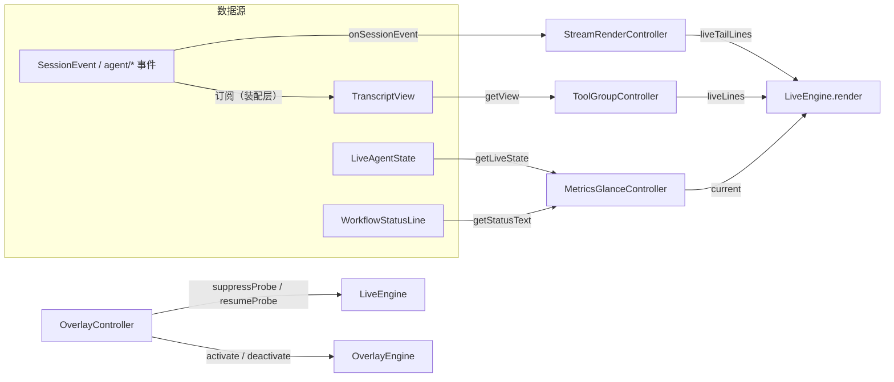

# TUI 渲染控制器层（renderLive 装配拆分）

[English](tui-render-controllers.md) | 中文

> 状态：已落地。四个控制器位于 `packages/tui/tui/src/engine/*-controller.ts`，装配点唯一持有人为 `ui/app.ts`——`renderLive()` 只做组合与着色，不再内联行源派生。

## 动机

`TuiApp.renderLive()` 单方法内联了 live 区的全部行源：状态行派生、错误行格式化、流式尾巴、进行中工具卡、slash 提示、输入行。六类职责互相牵连，无法独立单测，任何一处微调都可能波及整帧装配。控制器化把每类行源收敛为独立控制器，各有单测；`renderLive` 退化为「读控制器 → 组行 → 着色」的组合层。

控制器只消费既有数据（`session/event`、`agent/*`、`TranscriptView`、`LiveAgentState`），不发明事件类型；只组合 `engine/` 既有原语（LiveEngine / OverlayEngine / StreamRenderer / BlockStreamWriter / format 层），不修改它们。

## 控制器地图

## 各控制器契约

### `engine/stream-render-controller.ts`

流式提交/尾部控制。组合 BlockStreamWriter（节流切块）+ StreamRenderer（稳定块commit、尾部原始文本）。装配语义与旧内联等价：`minChars 60 / maxChars 200 / idleMs 180`；`onChange` 在块 commit 或尾部增长时触发（与旧的「每块恰一次renderLive」一致）。

- `pushTextDelta(text)`：喂入 assistant text-delta。
- `onSessionEvent(event)`：折叠 `assistant/chunk`（text-delta → push）、`assistant/message`（→ flush）、`turn/end`（非 aborted → flush）。
- `flush()`：吐尽节流缓冲 + finalize renderer（消息边界/turn 收尾）。
- `discard()`：丢弃未提交内容（abort / 会话切换共用；同时清 writer idle 定时器）。
- `liveTailLines(maxRows)`：renderer pending + writer 未吐缓冲的合并尾部。
- `hasContent / hasCommitted`：透传 renderer 状态。

### `engine/overlay-controller.ts`

overlay 生命周期 + CPR suppress/resume 协调。直通 OverlayEngine 的register/unregister/activate/deactivate/rerender，并在进入/退出 alt screen 时自动调用 LiveEngine 的 `suppressProbe()` / `resumeProbe()`——消除「overlay 光标位置被 CPR 误判为主屏污染 → 主屏帧写进 alt screen」的根因（picker 残影类）。`onOverlayChange(active)` 供上层暂停 live 渲染/ticker。无 overlay 注册时零输出，不改变现有行为。

### `engine/metrics-glance-controller.ts`

底部 glance 数据收集与刷新节流（Phase 5.3 数据基础）。纯函数 `deriveGlance` / `deriveGlanceStatus` / `deriveGlanceError` 复刻旧 renderLive 的状态行回退与错误行格式化；控制器把它们包进「窗口内合并、窗口末重算」的节流（默认 16ms 一帧），首次 `refresh()` 恒同步。`current()` 供 renderLive 每帧读取缓存。

### `engine/tool-group-controller.ts`

进行中工具卡聚合。从 TranscriptView 投影 `result === undefined` 的 tool/call（按 view 对象身份缓存），`liveLines()` 逐个 `formatToolCardLive` 渲染——与 Phase 5-7 现有可见行为逐字节等价。`pendingGroups()` / `groupedLines()` 提供Phase 7.3 并行分组折叠投影与渲染（组合 `format/tool-group.ts` 纯 fold），非默认路径，不改变现有可见行为。

## 行为保持清单（Phase 5-7 已上线功能）

- 状态行：`WorkflowStatusLine.current` 优先，否则 agent 状态回退（running/空闲/已停止）——由 `deriveGlanceStatus` 原样复刻。
- 错误行：glyph（ascii 降级）+ 首行截断至 `cols-2`——由 `deriveGlanceError` 原样复刻。
- 流式尾巴：`getLiveTailLines(6, writer.peek())`，原始文本防围栏闪烁。
- 进行中工具卡：逐个 `formatToolCardLive`（tailLines=2、tick 动画）。
- slash 提示与输入行仍在装配层，未迁移。

## 反目标

- 不做 council/team/worker 多 agent 面板；不注册 starmap/cockpit/chronicle 等星域 overlay（OverlayController 只是通用生命周期容器）。
- 不发明新事件类型；不修改 agent-loop/core/session 包；不修改 engine/ 既有原语。
- 不移植天枢的 virtue-settlement、星域叙事、信息素记忆、CVM 全套。
